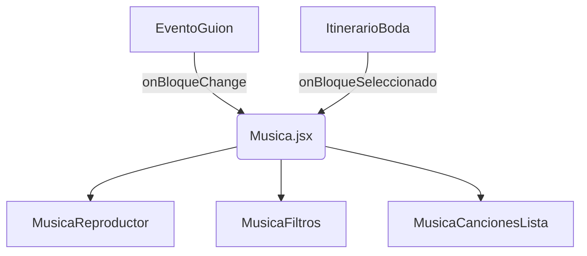

#reproductormusicamp3

**Reproductor de Audio para Eventos**

---

## **📌 Sistema de Reproductor para Bodas - Documentación**

### **🎯 Objetivo Principal**
Automatizar la música y el flujo de un evento de boda (9 horas) mediante:
- **Reproducción automática** por bloques de tiempo.
- **Sincronización** con el guión del evento.
- **Controles manuales** con alertas para cambios no programados.
- **Visualización** del progreso en tiempo real.

---

## **🧩 Componentes Principales**

### **1. `EventoGuion.jsx`**
**Función**:  
- Línea de tiempo maestra que controla el flujo del evento completo (19:00 a 04:00).  
- Sincroniza los bloques musicales con el guión de la boda.

**Características**:
- Muestra el **bloque actual** y el **tiempo restante**.
- Lista los **próximos 3 eventos**.
- Barra de progreso visual con todos los bloques.
- Controles para **iniciar/pausar** el evento.

---

### **2. `ItinerarioBoda.jsx`**
**Función**:  
- Versión detallada del guión de la boda (como un "script" visual).  
- Permite hacer clic en cualquier evento para saltar a ese bloque.

**Contenido**:
- Horarios exactos (ej: "19:00 - 20:00 | Recepción").
- Descripción de cada actividad.
- Destaca eventos importantes (como la ceremonia o el baile).

---

### **3. `Musica.jsx`** *(Componente Padre)*
**Función**:  
- Coordina todos los subcomponentes y maneja el estado global.

**Estados clave**:
- `bloques`: Datos del JSON con todas las canciones.
- `bloqueActual`: Bloque seleccionado ("todo" o específico).
- `currentSong`: Canción en reproducción.
- `isPlaying`: Estado de play/pause.

**Conexiones**:
- Recibe cambios de `EventoGuion` y `ItinerarioBoda`.
- Almacena el estado en `localStorage`.

---

### **4. `MusicaReproductor.jsx`**
**Función**:  
- Interfaz de reproductor clásico (play, pause, next, volume).

**Controles**:
- Muestra la **canción actual** (portada, nombre, artista).
- Barra de progreso de la canción.
- Botones de navegación y volumen.

---

### **5. `MusicaFiltros.jsx`**
**Función**:  
- Filtra canciones por bloques (ej: "Cena", "Baile", "Todo el evento").

**Interfaz**:
- Selector dropdown + botones rápidos.

---

### **6. `MusicaCancionesLista.jsx`**
**Función**:  
- Lista todas las canciones del bloque seleccionado.
- Permite hacer clic para reproducir cualquier canción.

---

## **🔄 Flujo de Datos**


1. **`EventoGuion`** y **`ItinerarioBoda`** notifican a **`Musica.jsx`** cuando cambia el bloque.
2. **`Musica.jsx`** actualiza:
   - La lista de canciones (`filteredSongs`).
   - La canción actual (`currentSong`).
3. Los cambios se reflejan en todos los subcomponentes.

---

## **📂 Estructura de Archivos**
```
src/
├── componentes/
│   ├── EventoGuion.jsx
│   ├── ItinerarioBoda.jsx
│   ├── Musica.jsx
│   ├── MusicaReproductor.jsx
│   ├── MusicaFiltros.jsx
│   ├── MusicaCancionesLista.jsx
│   └── MusicaContexto.js
├── assets/
│   └── scss/
│       ├── _03-Componentes/
│       │   ├── _Musica.scss
│       │   ├── _EventoGuion.scss
│       │   └── ... 
└── public/
    └── bodalistacompleta.json
```

---

## **🔧 Funcionalidades Clave**
1. **Reproducción automática**:  
   - Avanza por los bloques según el horario real.
   - Ejemplo: A las 20:00 pasa automáticamente a la música de "Ceremonia".

2. **Modo manual**:  
   - Permite saltar entre bloques o canciones con **alertas** para evitar cortes bruscos.

3. **Persistencia**:  
   - Guarda el estado (canción, volumen, bloque) en `localStorage`.

4. **Responsive**:  
   - Diseño adaptable a móvil, tablet y desktop.

---


# reproductormusicamp3
